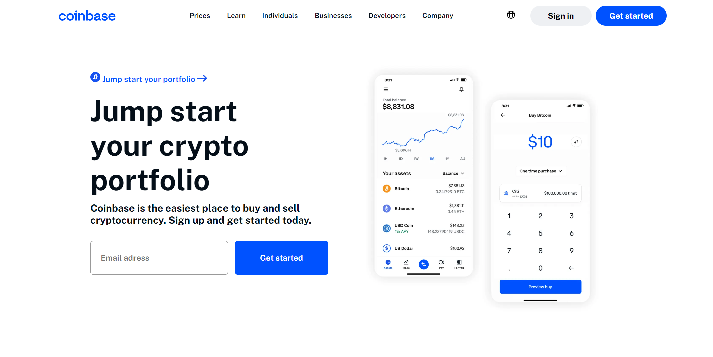

# Coinbase UI Clone (Front-End)

🚀 A front-end clone of the Coinbase user interface built with HTML, CSS, and JavaScript.

## Demo

🔗 View the live demo [here](https://coinbase-ui-clone.netlify.app/).

## Features

- **Responsive Design:** The Coinbase UI clone is designed to be responsive, ensuring it looks great on various screen sizes and devices.

## Usage

💡 You can use this front-end Coinbase UI clone as a reference or starting point for your own cryptocurrency-related projects. It provides a foundation for creating a user interface for your application.

## Technologies Used

- HTML
- CSS
- JavaScript

## License

📜 This project is licensed under the MIT License.

Feel free to reach out if you have any questions or need assistance. Enjoy working with this front-end Coinbase UI clone! 🌟
